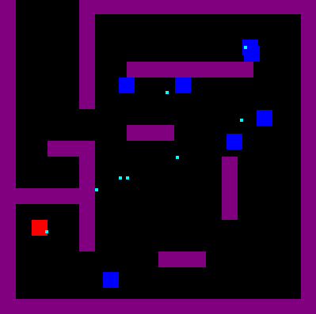

# 2d-block-attack-game

A 2D game where you can attack other blocks

## How to run it locally

1. Install Elm with `npm i -g elm`
2. Run `elm make src/Main.elm --output build/elm.js`
3. Open the build/index.html file in the browser with `open build/index.html`

